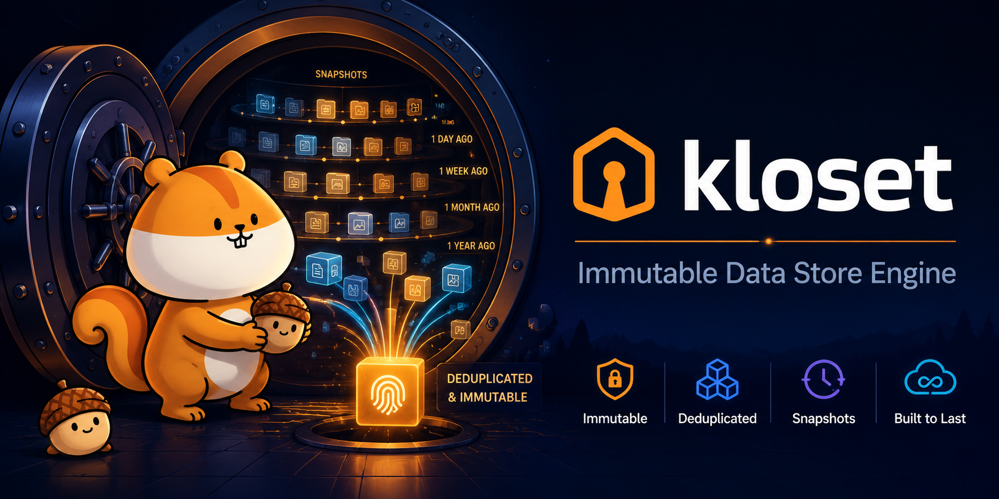

<p align="center">
  
</p>

# Kloset

**The immutable, encrypted, deduplicating data store engine that powers [Plakar](https://github.com/PlakarKorp/plakar).**

[](https://pkg.go.dev/github.com/PlakarKorp/kloset)
[](https://goreportcard.com/report/github.com/PlakarKorp/kloset)
[](https://codecov.io/gh/PlakarKorp/kloset)
[](LICENSE)

Kloset is a Go library, not a command-line tool. It provides the storage engine
on top of which data-protection applications such as [Plakar](https://github.com/PlakarKorp/plakar)
are built. If you are looking for a ready-to-use backup CLI, start with Plakar.
If you want to embed an immutable, content-addressed data store in your own
software, you are in the right place.

> Background reading: [Kloset — the immutable data store](https://www.plakar.io/posts/2025-04-29/kloset-the-immutable-data-store/).

## What it does

Kloset takes a stream of records (files, objects, extended attributes, …),
chunks them with content-defined chunking, deduplicates the chunks, then
compresses, encrypts, and packs them into immutable packfiles written to a
pluggable storage backend. Every stored object is content-addressed by a MAC
(message authentication code), so identical data is only ever stored once and
nothing can be silently mutated after the fact.

A *snapshot* captures a point-in-time view of a source, indexed through on-disk
B-trees so that very large datasets can be browsed and restored with bounded
memory.

### Core properties

- **Immutable & content-addressed** — objects are keyed by their MAC; writes are append-only and verifiable.
- **Deduplicated** — content-defined chunking ([FastCDC-style](chunking/)) means common data is stored once across all snapshots.
- **End-to-end encrypted** — data *and* metadata are encrypted; see the [cryptography audit](https://www.plakar.io/posts/2025-02-28/audit-of-plakar-cryptography/) and [`docs/audit/`](docs/audit/).
- **Compressed** — pluggable compression (LZ4 and others) applied before encryption.
- **Memory-bounded** — on-disk B-tree indexes keep RAM usage flat regardless of dataset size.
- **Concurrent** — supports high concurrency and multiple backup types in a single store.
- **Lock-free maintenance** — garbage collection runs without blocking reads or writes.
- **Storage-agnostic** — back up to one storage type and restore to another.

## Architecture

Kloset is organized around three pluggable connector interfaces and a set of
core engine packages.

### Connectors

Connectors are registered by name and resolved from a location string (e.g.
`fs://`, `s3://`). This is how Kloset reads from arbitrary sources, writes to
arbitrary destinations, and persists to arbitrary backends.

| Interface | Package | Role |
|-----------|---------|------|
| `Importer` | [`connectors/importer`](connectors/importer/) | Reads records from a source (filesystem, object store, SaaS, …) |
| `Exporter` | [`connectors/exporter`](connectors/exporter/) | Writes records back out during restore |
| `Store` | [`connectors/storage`](connectors/storage/) | Persists the immutable packfiles and state (filesystem, S3, …) |

Each interface is small and stream-oriented. For example, an importer streams
`*connectors.Record` values into the engine and receives `*connectors.Result`
acknowledgements back:

```go
type Importer interface {
	Origin() string
	Type() string
	Root() string
	Flags() location.Flags
	Ping(context.Context) error
	Import(context.Context, chan<- *connectors.Record, <-chan *connectors.Result) error
	Close(context.Context) error
}
```

Register a backend so it can be resolved from a location string:

```go
importer.Register("myproto", flags, func(ctx context.Context, opts *connectors.Options, name string, config map[string]string) (importer.Importer, error) {
	// ...
})
```

### Engine packages

| Package | Responsibility |
|---------|----------------|
| [`repository`](repository/) | Opens/creates a repository over a `storage.Store`; read and write paths |
| [`snapshot`](snapshot/) | Builds, loads, checks, restores, and synchronizes snapshots |
| [`snapshot/vfs`](snapshot/vfs/) | Virtual filesystem view over a snapshot for browsing/restore |
| [`chunking`](chunking/) | Content-defined chunking |
| [`hashing`](hashing/) | MAC / content addressing |
| [`compression`](compression/) | Pluggable compression |
| [`encryption`](encryption/) | Authenticated symmetric encryption of data and metadata |
| [`packfile`](packfile/) | Immutable packfile format (in-memory and on-disk) |
| [`btree`](btree/) | On-disk B-tree indexes for memory-bounded browsing |
| [`caching`](caching/) | Local caches for repository, packing, and maintenance |
| [`resources`](resources/) | Typed resource kinds (config, state, packfile, snapshot, …) |
| [`kcontext`](kcontext/) | Engine-wide context (logging, concurrency, identity) |

## Installation

```sh
go get github.com/PlakarKorp/kloset@latest
```

Kloset requires **Go 1.25** or newer.

## Usage sketch

Kloset is consumed as a library. A typical flow:

```go
import (
	"github.com/PlakarKorp/kloset/kcontext"
	"github.com/PlakarKorp/kloset/repository"
	"github.com/PlakarKorp/kloset/snapshot"
)

ctx := kcontext.NewKContext()

// Open a repository over a storage backend, decrypting with the secret.
repo, err := repository.New(ctx, secret, store, config)
if err != nil {
	// ...
}

// Build a snapshot from one or more importers, then load it back to browse or restore.
builder, err := snapshot.Create(repo, repository.DefaultType, tmpDir, snapID, opts)
// ... feed records, commit ...

snap, err := snapshot.Load(repo, snapID)
```

See the package documentation on [pkg.go.dev](https://pkg.go.dev/github.com/PlakarKorp/kloset)
for the full API, and the `*_test.go` files throughout the tree for runnable
examples.

## Relationship to Plakar

| | |
|---|---|
| **Kloset** (this repo) | The storage engine: chunking, dedup, encryption, packfiles, indexing, connectors. A Go library. |
| **[Plakar](https://github.com/PlakarKorp/plakar)** | The application: CLI, web UI, scheduling, integrations — built on Kloset. |

If you want to *use* Kloset's capabilities, you almost certainly want Plakar.
If you want to *build on top of* Kloset, use this library directly.

## Documentation

- API reference: [pkg.go.dev/github.com/PlakarKorp/kloset](https://pkg.go.dev/github.com/PlakarKorp/kloset)
- Cryptography audit: [`docs/audit/`](docs/audit/) and the [audit blog post](https://www.plakar.io/posts/2025-02-28/audit-of-plakar-cryptography/)
- Plakar documentation: [plakar.io/docs](https://plakar.io/docs/)

## Community

Join our active [Discord](https://discord.com/invite/uqdP9Wfzx3) to discuss the project.

## License

Kloset is released under the ISC License. See [LICENSE](LICENSE).
